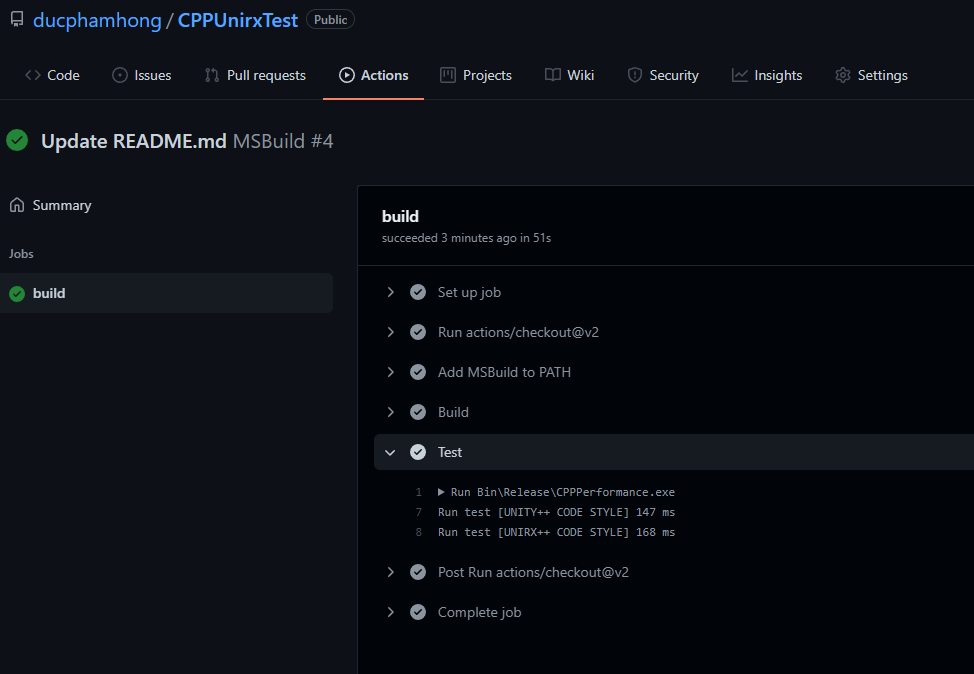

# CPPUnirxTest

Test so sánh hiệu năng Unirx viết bằng C++

## Unity++ style
```C++
// Source/Behavior.cpp
void Behavior::Update()
{
	switch (state)
	{
	case 0:
		DoSomeThing0();
		break;
	case 1:
		DoSomeThing1();
		break;
	default:
		break;
	}
}

void Behavior::DoSomeThing0()
{
	double a = sin(M_PI);
	double b = cos(M_PI);
	double r = a * b;

	char result[512];
	char s[64];
	sprintf(s, "%f", r);

	const char* n = "RESULT";
	sprintf(result, "%s%s", n, s);
}

void Behavior::DoSomeThing1()
{
	double a = sin(M_PI);
	double b = cos(M_PI);
	double r = a * b;

	char result[512];
	char s[64];
	sprintf(s, "%f", r);

	const char* n = "RESULT";
	sprintf(result, "%s%s", n, s);
}

```

## Unirx++ style
```C++
// Source/Behavior.cpp
void Behavior::InitUnirx()
{
	gameObject->AsObserver()->AddTo(
		[&](GameObject* go)
		{
			return state == 0;
		},
		[](GameObject* go) {
			double a = sin(M_PI);
			double b = cos(M_PI);
			double r = a * b;

			char result[512];
			char s[64];
			sprintf(s, "%f", r);

			const char* n = "RESULT";
			sprintf(result, "%s%s", n, s);
		}, gameObject);


	gameObject->AsObserver()->AddTo(
		[&](GameObject* go)
		{
			return state == 1;
		},
		[](GameObject* go) {
			double a = sin(M_PI);
			double b = cos(M_PI);
			double r = a * b;

			char result[512];
			char s[64];
			sprintf(s, "%f", r);

			const char* n = "RESULT";
			sprintf(result, "%s%s", n, s);
		}, gameObject);
}
```

## Chương trình test trên 30000 gameobject
```C++
// Source/main.cpp
void main()
{
	InitTime();

	std::vector<GameObject*> gameObjects;

	for (int i = 0; i < 30000; i++)
		gameObjects.push_back(new GameObject());

	BeginTest("[UNITY++ CODE STYLE]");
	for (GameObject* obj : gameObjects)
		obj->Update();
	EndTest();


	for (GameObject* obj : gameObjects)
		obj->InitUnirx();

	BeginTest("[UNIRX++ CODE STYLE]");
	for (GameObject* obj : gameObjects)
		obj->UpdateUnirx();
	EndTest();

	for (GameObject* obj : gameObjects)
		delete obj;
}
```

## Kết quả từ [Github Action](https://github.com/ducphamhong/CPPUnirxTest/runs/3781299583?check_suite_focus=true)


## Kết luận
Kết quả cho thấy Unirx chậm hơn cách truyền thống tầm 10%.

So sánh với [C# Test](https://github.com/ducphamhong/CShaftUnityUnirxTest) với C++ thì hiện nay tốc độ của 2 ngôn ngữ gần như ngang ngữa.
Tuy nhiên nếu chạy theo thời lâu dài thì C# sẽ bị hụt hơn 1 xíu ở xử lý GC. Vì khi C# chạy memory sẽ bị lead cần chờ GC xử lý.

